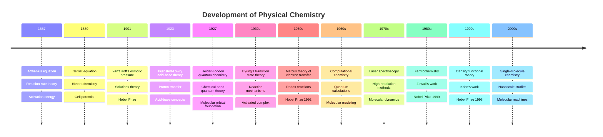

```mermaid
timeline
    title Development of Physical Chemistry
    1887 : Arrhenius equation
          : Reaction rate theory
          : Activation energy
    1889 : Nernst equation
          : Electrochemistry
          : Cell potential
    1901 : van't Hoff's osmotic pressure
          : Solutions theory
          : Nobel Prize
    1923 : Brønsted-Lowry acid-base theory
          : Proton transfer
          : Acid-base concepts
    1927 : Heitler-London quantum chemistry
          : Chemical bond quantum theory
          : Molecular orbital foundation
    1930s : Eyring's transition state theory
          : Reaction mechanisms
          : Activated complex
    1950s : Marcus theory of electron transfer
          : Redox reactions
          : Nobel Prize 1992
    1960s : Computational chemistry
          : Quantum calculations
          : Molecular modeling
    1970s : Laser spectroscopy
          : High-resolution methods
          : Molecular dynamics
    1980s : Femtochemistry
          : Zewail's work
          : Nobel Prize 1999
    1990s : Density functional theory
          : Kohn's work
          : Nobel Prize 1998
    2000s : Single-molecule chemistry
          : Nanoscale studies
          : Molecular machines
```
