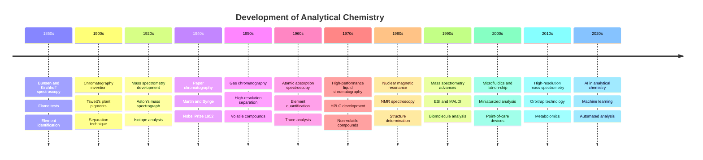

```mermaid
timeline
    title Development of Analytical Chemistry
    1850s : Bunsen and Kirchhoff spectroscopy
          : Flame tests
          : Element identification
    1900s : Chromatography invention
          : Tswett's plant pigments
          : Separation technique
    1920s : Mass spectrometry development
          : Aston's mass spectrograph
          : Isotope analysis
    1940s : Paper chromatography
          : Martin and Synge
          : Nobel Prize 1952
    1950s : Gas chromatography
          : High-resolution separation
          : Volatile compounds
    1960s : Atomic absorption spectroscopy
          : Element quantification
          : Trace analysis
    1970s : High-performance liquid chromatography
          : HPLC development
          : Non-volatile compounds
    1980s : Nuclear magnetic resonance
          : NMR spectroscopy
          : Structure determination
    1990s : Mass spectrometry advances
          : ESI and MALDI
          : Biomolecule analysis
    2000s : Microfluidics and lab-on-chip
          : Miniaturized analysis
          : Point-of-care devices
    2010s : High-resolution mass spectrometry
          : Orbitrap technology
          : Metabolomics
    2020s : AI in analytical chemistry
          : Machine learning
          : Automated analysis
```
