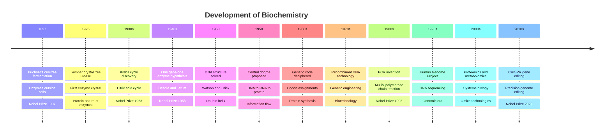

```mermaid
timeline
    title Development of Biochemistry
    1897 : Buchner's cell-free fermentation
          : Enzymes outside cells
          : Nobel Prize 1907
    1926 : Sumner crystallizes urease
          : First enzyme crystal
          : Protein nature of enzymes
    1930s : Krebs cycle discovery
          : Citric acid cycle
          : Nobel Prize 1953
    1940s : One gene-one enzyme hypothesis
          : Beadle and Tatum
          : Nobel Prize 1958
    1953 : DNA structure solved
          : Watson and Crick
          : Double helix
    1958 : Central dogma proposed
          : DNA to RNA to protein
          : Information flow
    1960s : Genetic code deciphered
          : Codon assignments
          : Protein synthesis
    1970s : Recombinant DNA technology
          : Genetic engineering
          : Biotechnology
    1980s : PCR invention
          : Mullis' polymerase chain reaction
          : Nobel Prize 1993
    1990s : Human Genome Project
          : DNA sequencing
          : Genomic era
    2000s : Proteomics and metabolomics
          : Systems biology
          : Omics technologies
    2010s : CRISPR gene editing
          : Precision genome editing
          : Nobel Prize 2020
```
