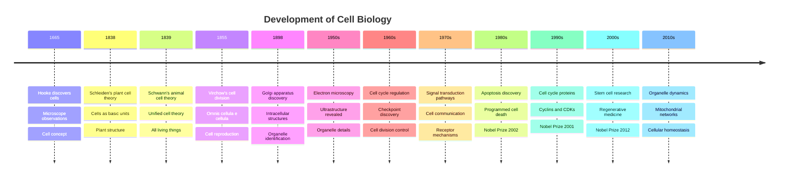

```mermaid
timeline
    title Development of Cell Biology
    1665 : Hooke discovers cells
          : Microscope observations
          : Cell concept
    1838 : Schleiden's plant cell theory
          : Cells as basic units
          : Plant structure
    1839 : Schwann's animal cell theory
          : Unified cell theory
          : All living things
    1855 : Virchow's cell division
          : Omnis cellula e cellula
          : Cell reproduction
    1898 : Golgi apparatus discovery
          : Intracellular structures
          : Organelle identification
    1950s : Electron microscopy
          : Ultrastructure revealed
          : Organelle details
    1960s : Cell cycle regulation
          : Checkpoint discovery
          : Cell division control
    1970s : Signal transduction pathways
          : Cell communication
          : Receptor mechanisms
    1980s : Apoptosis discovery
          : Programmed cell death
          : Nobel Prize 2002
    1990s : Cell cycle proteins
          : Cyclins and CDKs
          : Nobel Prize 2001
    2000s : Stem cell research
          : Regenerative medicine
          : Nobel Prize 2012
    2010s : Organelle dynamics
          : Mitochondrial networks
          : Cellular homeostasis
```
