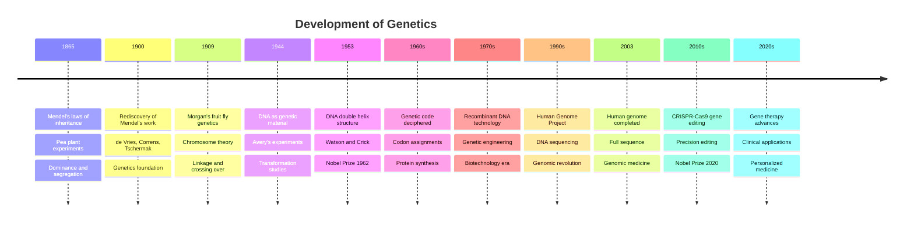

```mermaid
timeline
    title Development of Genetics
    1865 : Mendel's laws of inheritance
          : Pea plant experiments
          : Dominance and segregation
    1900 : Rediscovery of Mendel's work
          : de Vries, Correns, Tschermak
          : Genetics foundation
    1909 : Morgan's fruit fly genetics
          : Chromosome theory
          : Linkage and crossing over
    1944 : DNA as genetic material
          : Avery's experiments
          : Transformation studies
    1953 : DNA double helix structure
          : Watson and Crick
          : Nobel Prize 1962
    1960s : Genetic code deciphered
          : Codon assignments
          : Protein synthesis
    1970s : Recombinant DNA technology
          : Genetic engineering
          : Biotechnology era
    1990s : Human Genome Project
          : DNA sequencing
          : Genomic revolution
    2003 : Human genome completed
          : Full sequence
          : Genomic medicine
    2010s : CRISPR-Cas9 gene editing
          : Precision editing
          : Nobel Prize 2020
    2020s : Gene therapy advances
          : Clinical applications
          : Personalized medicine
```
