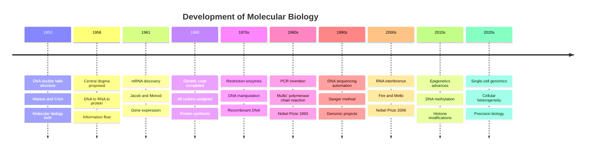

```mermaid
timeline
    title Development of Molecular Biology
    1953 : DNA double helix structure
          : Watson and Crick
          : Molecular biology birth
    1958 : Central dogma proposed
          : DNA to RNA to protein
          : Information flow
    1961 : mRNA discovery
          : Jacob and Monod
          : Gene expression
    1965 : Genetic code completed
          : All codons assigned
          : Protein synthesis
    1970s : Restriction enzymes
          : DNA manipulation
          : Recombinant DNA
    1980s : PCR invention
          : Mullis' polymerase chain reaction
          : Nobel Prize 1993
    1990s : DNA sequencing automation
          : Sanger method
          : Genomic projects
    2000s : RNA interference
          : Fire and Mello
          : Nobel Prize 2006
    2010s : Epigenetics advances
          : DNA methylation
          : Histone modifications
    2020s : Single-cell genomics
          : Cellular heterogeneity
          : Precision biology
```
