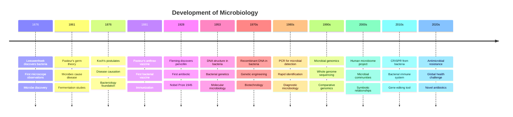

```mermaid
timeline
    title Development of Microbiology
    1676 : Leeuwenhoek discovers bacteria
          : First microscope observations
          : Microbe discovery
    1861 : Pasteur's germ theory
          : Microbes cause disease
          : Fermentation studies
    1876 : Koch's postulates
          : Disease causation
          : Bacteriology foundation
    1881 : Pasteur's anthrax vaccine
          : First bacterial vaccine
          : Immunization
    1928 : Fleming discovers penicillin
          : First antibiotic
          : Nobel Prize 1945
    1953 : DNA structure in bacteria
          : Bacterial genetics
          : Molecular microbiology
    1970s : Recombinant DNA in bacteria
          : Genetic engineering
          : Biotechnology
    1980s : PCR for microbial detection
          : Rapid identification
          : Diagnostic microbiology
    1990s : Microbial genomics
          : Whole genome sequencing
          : Comparative genomics
    2000s : Human microbiome project
          : Microbial communities
          : Symbiotic relationships
    2010s : CRISPR from bacteria
          : Bacterial immune system
          : Gene editing tool
    2020s : Antimicrobial resistance
          : Global health challenge
          : Novel antibiotics
```
