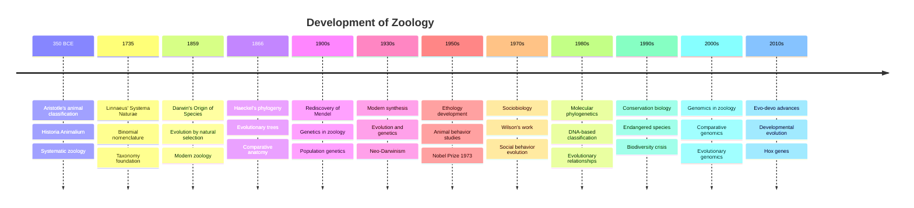

```mermaid
timeline
    title Development of Zoology
    350 BCE : Aristotle's animal classification
          : Historia Animalium
          : Systematic zoology
    1735 : Linnaeus' Systema Naturae
          : Binomial nomenclature
          : Taxonomy foundation
    1859 : Darwin's Origin of Species
          : Evolution by natural selection
          : Modern zoology
    1866 : Haeckel's phylogeny
          : Evolutionary trees
          : Comparative anatomy
    1900s : Rediscovery of Mendel
          : Genetics in zoology
          : Population genetics
    1930s : Modern synthesis
          : Evolution and genetics
          : Neo-Darwinism
    1950s : Ethology development
          : Animal behavior studies
          : Nobel Prize 1973
    1970s : Sociobiology
          : Wilson's work
          : Social behavior evolution
    1980s : Molecular phylogenetics
          : DNA-based classification
          : Evolutionary relationships
    1990s : Conservation biology
          : Endangered species
          : Biodiversity crisis
    2000s : Genomics in zoology
          : Comparative genomics
          : Evolutionary genomics
    2010s : Evo-devo advances
          : Developmental evolution
          : Hox genes
```
