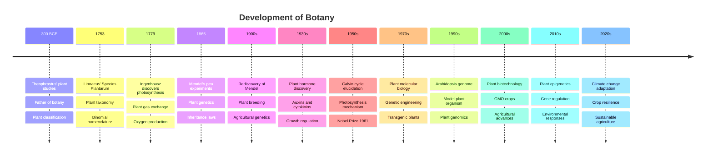

```mermaid
timeline
    title Development of Botany
    300 BCE : Theophrastus' plant studies
          : Father of botany
          : Plant classification
    1753 : Linnaeus' Species Plantarum
          : Plant taxonomy
          : Binomial nomenclature
    1779 : Ingenhousz discovers photosynthesis
          : Plant gas exchange
          : Oxygen production
    1865 : Mendel's pea experiments
          : Plant genetics
          : Inheritance laws
    1900s : Rediscovery of Mendel
          : Plant breeding
          : Agricultural genetics
    1930s : Plant hormone discovery
          : Auxins and cytokinins
          : Growth regulation
    1950s : Calvin cycle elucidation
          : Photosynthesis mechanism
          : Nobel Prize 1961
    1970s : Plant molecular biology
          : Genetic engineering
          : Transgenic plants
    1990s : Arabidopsis genome
          : Model plant organism
          : Plant genomics
    2000s : Plant biotechnology
          : GMO crops
          : Agricultural advances
    2010s : Plant epigenetics
          : Gene regulation
          : Environmental responses
    2020s : Climate change adaptation
          : Crop resilience
          : Sustainable agriculture
```
