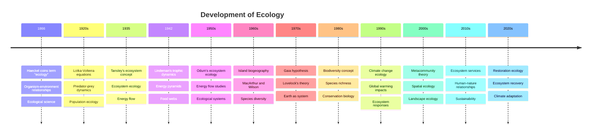

```mermaid
timeline
    title Development of Ecology
    1866 : Haeckel coins term "ecology"
          : Organism-environment relationships
          : Ecological science
    1920s : Lotka-Volterra equations
          : Predator-prey dynamics
          : Population ecology
    1935 : Tansley's ecosystem concept
          : Ecosystem ecology
          : Energy flow
    1942 : Lindeman's trophic dynamics
          : Energy pyramids
          : Food webs
    1950s : Odum's ecosystem ecology
          : Energy flow studies
          : Ecological systems
    1960s : Island biogeography
          : MacArthur and Wilson
          : Species diversity
    1970s : Gaia hypothesis
          : Lovelock's theory
          : Earth as system
    1980s : Biodiversity concept
          : Species richness
          : Conservation biology
    1990s : Climate change ecology
          : Global warming impacts
          : Ecosystem responses
    2000s : Metacommunity theory
          : Spatial ecology
          : Landscape ecology
    2010s : Ecosystem services
          : Human-nature relationships
          : Sustainability
    2020s : Restoration ecology
          : Ecosystem recovery
          : Climate adaptation
```
