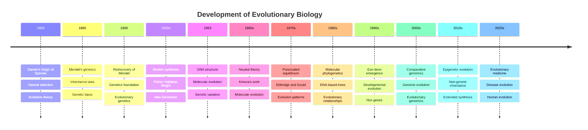

```mermaid
timeline
    title Development of Evolutionary Biology
    1859 : Darwin's Origin of Species
          : Natural selection
          : Evolution theory
    1865 : Mendel's genetics
          : Inheritance laws
          : Genetic basis
    1900 : Rediscovery of Mendel
          : Genetics foundation
          : Evolutionary genetics
    1930s : Modern synthesis
          : Fisher, Haldane, Wright
          : Neo-Darwinism
    1953 : DNA structure
          : Molecular evolution
          : Genetic variation
    1960s : Neutral theory
          : Kimura's work
          : Molecular evolution
    1970s : Punctuated equilibrium
          : Eldredge and Gould
          : Evolution patterns
    1980s : Molecular phylogenetics
          : DNA-based trees
          : Evolutionary relationships
    1990s : Evo-devo emergence
          : Developmental evolution
          : Hox genes
    2000s : Comparative genomics
          : Genome evolution
          : Evolutionary genomics
    2010s : Epigenetic evolution
          : Non-genetic inheritance
          : Extended synthesis
    2020s : Evolutionary medicine
          : Disease evolution
          : Human evolution
```
