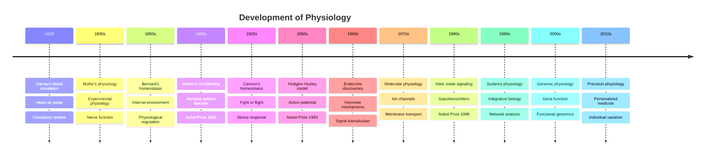

```mermaid
timeline
    title Development of Physiology
    1628 : Harvey's blood circulation
          : Heart as pump
          : Circulatory system
    1830s : Müller's physiology
          : Experimental physiology
          : Nerve function
    1850s : Bernard's homeostasis
          : Internal environment
          : Physiological regulation
    1900s : Pavlov's conditioning
          : Nervous system function
          : Nobel Prize 1904
    1920s : Cannon's homeostasis
          : Fight or flight
          : Stress response
    1950s : Hodgkin-Huxley model
          : Action potential
          : Nobel Prize 1963
    1960s : Endocrine discoveries
          : Hormone mechanisms
          : Signal transduction
    1970s : Molecular physiology
          : Ion channels
          : Membrane transport
    1980s : Nitric oxide signaling
          : Gasotransmitters
          : Nobel Prize 1998
    1990s : Systems physiology
          : Integrative biology
          : Network analysis
    2000s : Genomic physiology
          : Gene function
          : Functional genomics
    2010s : Precision physiology
          : Personalized medicine
          : Individual variation
```
