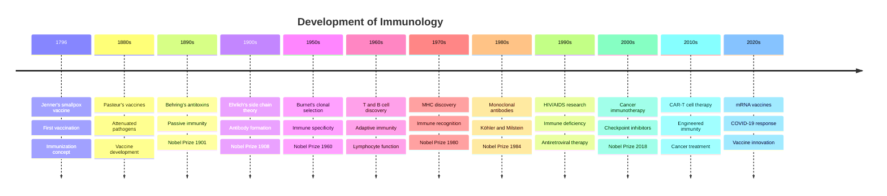

```mermaid
timeline
    title Development of Immunology
    1796 : Jenner's smallpox vaccine
          : First vaccination
          : Immunization concept
    1880s : Pasteur's vaccines
          : Attenuated pathogens
          : Vaccine development
    1890s : Behring's antitoxins
          : Passive immunity
          : Nobel Prize 1901
    1900s : Ehrlich's side chain theory
          : Antibody formation
          : Nobel Prize 1908
    1950s : Burnet's clonal selection
          : Immune specificity
          : Nobel Prize 1960
    1960s : T and B cell discovery
          : Adaptive immunity
          : Lymphocyte function
    1970s : MHC discovery
          : Immune recognition
          : Nobel Prize 1980
    1980s : Monoclonal antibodies
          : Köhler and Milstein
          : Nobel Prize 1984
    1990s : HIV/AIDS research
          : Immune deficiency
          : Antiretroviral therapy
    2000s : Cancer immunotherapy
          : Checkpoint inhibitors
          : Nobel Prize 2018
    2010s : CAR-T cell therapy
          : Engineered immunity
          : Cancer treatment
    2020s : mRNA vaccines
          : COVID-19 response
          : Vaccine innovation
```
