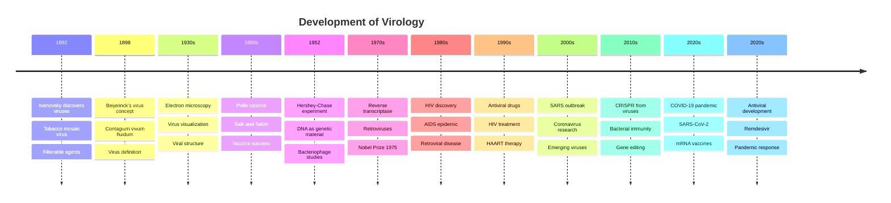

```mermaid
timeline
    title Development of Virology
    1892 : Ivanovsky discovers viruses
          : Tobacco mosaic virus
          : Filterable agents
    1898 : Beijerinck's virus concept
          : Contagium vivum fluidum
          : Virus definition
    1930s : Electron microscopy
          : Virus visualization
          : Viral structure
    1950s : Polio vaccine
          : Salk and Sabin
          : Vaccine success
    1952 : Hershey-Chase experiment
          : DNA as genetic material
          : Bacteriophage studies
    1970s : Reverse transcriptase
          : Retroviruses
          : Nobel Prize 1975
    1980s : HIV discovery
          : AIDS epidemic
          : Retroviral disease
    1990s : Antiviral drugs
          : HIV treatment
          : HAART therapy
    2000s : SARS outbreak
          : Coronavirus research
          : Emerging viruses
    2010s : CRISPR from viruses
          : Bacterial immunity
          : Gene editing
    2020s : COVID-19 pandemic
          : SARS-CoV-2
          : mRNA vaccines
    2020s : Antiviral development
          : Remdesivir
          : Pandemic response
```
