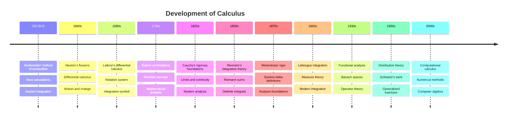

```mermaid
timeline
    title Development of Calculus
    250 BCE : Archimedes' method of exhaustion
          : Area calculations
          : Ancient integration
    1660s : Newton's fluxions
          : Differential calculus
          : Motion and change
    1680s : Leibniz's differential calculus
          : Notation system
          : Integration symbol
    1730s : Euler's contributions
          : Function concept
          : Mathematical analysis
    1820s : Cauchy's rigorous foundations
          : Limits and continuity
          : Modern analysis
    1850s : Riemann's integration theory
          : Riemann sums
          : Definite integrals
    1870s : Weierstrass' rigor
          : Epsilon-delta definitions
          : Analysis foundations
    1900s : Lebesgue integration
          : Measure theory
          : Modern integration
    1930s : Functional analysis
          : Banach spaces
          : Operator theory
    1950s : Distribution theory
          : Schwartz's work
          : Generalized functions
    2000s : Computational calculus
          : Numerical methods
          : Computer algebra
```
