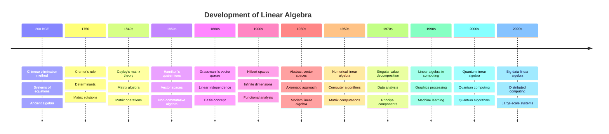

```mermaid
timeline
    title Development of Linear Algebra
    200 BCE : Chinese elimination method
          : Systems of equations
          : Ancient algebra
    1750 : Cramer's rule
          : Determinants
          : Matrix solutions
    1840s : Cayley's matrix theory
          : Matrix algebra
          : Matrix operations
    1850s : Hamilton's quaternions
          : Vector spaces
          : Non-commutative algebra
    1880s : Grassmann's vector spaces
          : Linear independence
          : Basis concept
    1900s : Hilbert spaces
          : Infinite dimensions
          : Functional analysis
    1930s : Abstract vector spaces
          : Axiomatic approach
          : Modern linear algebra
    1950s : Numerical linear algebra
          : Computer algorithms
          : Matrix computations
    1970s : Singular value decomposition
          : Data analysis
          : Principal components
    1990s : Linear algebra in computing
          : Graphics processing
          : Machine learning
    2000s : Quantum linear algebra
          : Quantum computing
          : Quantum algorithms
    2020s : Big data linear algebra
          : Distributed computing
          : Large-scale systems
```
