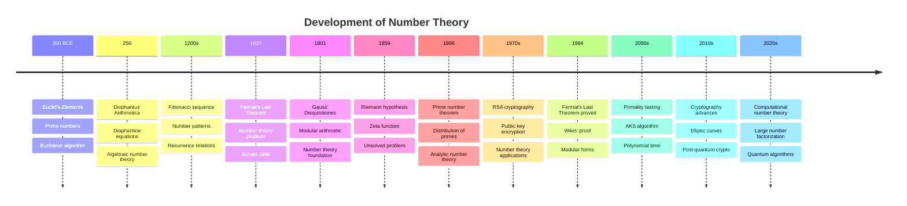

```mermaid
timeline
    title Development of Number Theory
    300 BCE : Euclid's Elements
          : Prime numbers
          : Euclidean algorithm
    250 : Diophantus' Arithmetica
          : Diophantine equations
          : Algebraic number theory
    1200s : Fibonacci sequence
          : Number patterns
          : Recurrence relations
    1637 : Fermat's Last Theorem
          : Number theory problem
          : Solved 1995
    1801 : Gauss' Disquisitiones
          : Modular arithmetic
          : Number theory foundation
    1859 : Riemann hypothesis
          : Zeta function
          : Unsolved problem
    1896 : Prime number theorem
          : Distribution of primes
          : Analytic number theory
    1970s : RSA cryptography
          : Public key encryption
          : Number theory applications
    1994 : Fermat's Last Theorem proved
          : Wiles' proof
          : Modular forms
    2000s : Primality testing
          : AKS algorithm
          : Polynomial time
    2010s : Cryptography advances
          : Elliptic curves
          : Post-quantum crypto
    2020s : Computational number theory
          : Large number factorization
          : Quantum algorithms
```
