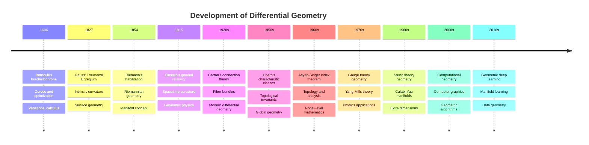

```mermaid
timeline
    title Development of Differential Geometry
    1696 : Bernoulli's brachistochrone
          : Curves and optimization
          : Variational calculus
    1827 : Gauss' Theorema Egregium
          : Intrinsic curvature
          : Surface geometry
    1854 : Riemann's habilitation
          : Riemannian geometry
          : Manifold concept
    1915 : Einstein's general relativity
          : Spacetime curvature
          : Geometric physics
    1920s : Cartan's connection theory
          : Fiber bundles
          : Modern differential geometry
    1950s : Chern's characteristic classes
          : Topological invariants
          : Global geometry
    1960s : Atiyah-Singer index theorem
          : Topology and analysis
          : Nobel-level mathematics
    1970s : Gauge theory geometry
          : Yang-Mills theory
          : Physics applications
    1980s : String theory geometry
          : Calabi-Yau manifolds
          : Extra dimensions
    2000s : Computational geometry
          : Computer graphics
          : Geometric algorithms
    2010s : Geometric deep learning
          : Manifold learning
          : Data geometry
```
