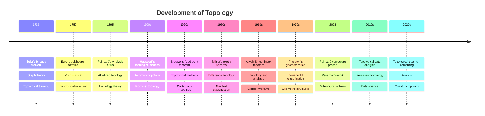

```mermaid
timeline
    title Development of Topology
    1736 : Euler's bridges problem
          : Graph theory
          : Topological thinking
    1750 : Euler's polyhedron formula
          : V - E + F = 2
          : Topological invariant
    1895 : Poincaré's Analysis Situs
          : Algebraic topology
          : Homology theory
    1900s : Hausdorff's topological spaces
          : Axiomatic topology
          : Point-set topology
    1920s : Brouwer's fixed point theorem
          : Topological methods
          : Continuous mappings
    1950s : Milnor's exotic spheres
          : Differential topology
          : Manifold classification
    1960s : Atiyah-Singer index theorem
          : Topology and analysis
          : Global invariants
    1970s : Thurston's geometrization
          : 3-manifold classification
          : Geometric structures
    2003 : Poincaré conjecture proved
          : Perelman's work
          : Millennium problem
    2010s : Topological data analysis
          : Persistent homology
          : Data science
    2020s : Topological quantum computing
          : Anyons
          : Quantum topology
```
