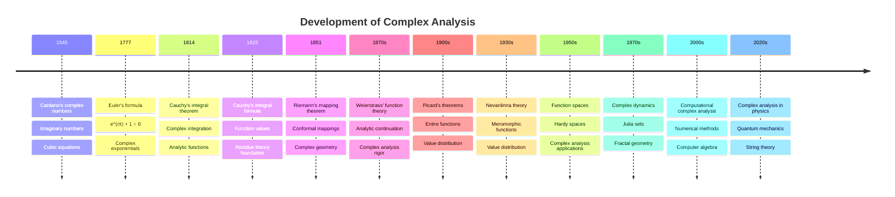

```mermaid
timeline
    title Development of Complex Analysis
    1545 : Cardano's complex numbers
          : Imaginary numbers
          : Cubic equations
    1777 : Euler's formula
          : e^(iπ) + 1 = 0
          : Complex exponentials
    1814 : Cauchy's integral theorem
          : Complex integration
          : Analytic functions
    1825 : Cauchy's integral formula
          : Function values
          : Residue theory foundation
    1851 : Riemann's mapping theorem
          : Conformal mappings
          : Complex geometry
    1870s : Weierstrass' function theory
          : Analytic continuation
          : Complex analysis rigor
    1900s : Picard's theorems
          : Entire functions
          : Value distribution
    1930s : Nevanlinna theory
          : Meromorphic functions
          : Value distribution
    1950s : Function spaces
          : Hardy spaces
          : Complex analysis applications
    1970s : Complex dynamics
          : Julia sets
          : Fractal geometry
    2000s : Computational complex analysis
          : Numerical methods
          : Computer algebra
    2020s : Complex analysis in physics
          : Quantum mechanics
          : String theory
```
