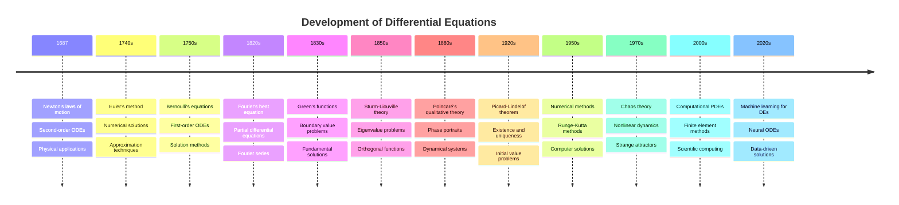

```mermaid
timeline
    title Development of Differential Equations
    1687 : Newton's laws of motion
          : Second-order ODEs
          : Physical applications
    1740s : Euler's method
          : Numerical solutions
          : Approximation techniques
    1750s : Bernoulli's equations
          : First-order ODEs
          : Solution methods
    1820s : Fourier's heat equation
          : Partial differential equations
          : Fourier series
    1830s : Green's functions
          : Boundary value problems
          : Fundamental solutions
    1850s : Sturm-Liouville theory
          : Eigenvalue problems
          : Orthogonal functions
    1880s : Poincaré's qualitative theory
          : Phase portraits
          : Dynamical systems
    1920s : Picard-Lindelöf theorem
          : Existence and uniqueness
          : Initial value problems
    1950s : Numerical methods
          : Runge-Kutta methods
          : Computer solutions
    1970s : Chaos theory
          : Nonlinear dynamics
          : Strange attractors
    2000s : Computational PDEs
          : Finite element methods
          : Scientific computing
    2020s : Machine learning for DEs
          : Neural ODEs
          : Data-driven solutions
```
