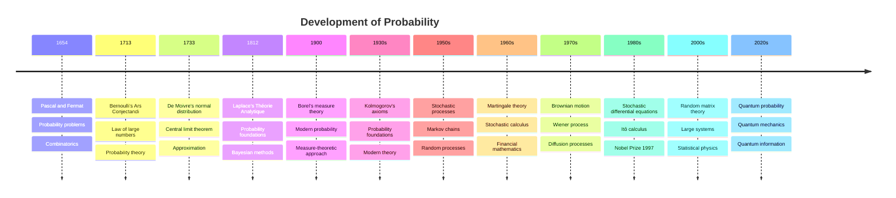

```mermaid
timeline
    title Development of Probability
    1654 : Pascal and Fermat
          : Probability problems
          : Combinatorics
    1713 : Bernoulli's Ars Conjectandi
          : Law of large numbers
          : Probability theory
    1733 : De Moivre's normal distribution
          : Central limit theorem
          : Approximation
    1812 : Laplace's Théorie Analytique
          : Probability foundations
          : Bayesian methods
    1900 : Borel's measure theory
          : Modern probability
          : Measure-theoretic approach
    1930s : Kolmogorov's axioms
          : Probability foundations
          : Modern theory
    1950s : Stochastic processes
          : Markov chains
          : Random processes
    1960s : Martingale theory
          : Stochastic calculus
          : Financial mathematics
    1970s : Brownian motion
          : Wiener process
          : Diffusion processes
    1980s : Stochastic differential equations
          : Itô calculus
          : Nobel Prize 1997
    2000s : Random matrix theory
          : Large systems
          : Statistical physics
    2020s : Quantum probability
          : Quantum mechanics
          : Quantum information
```
