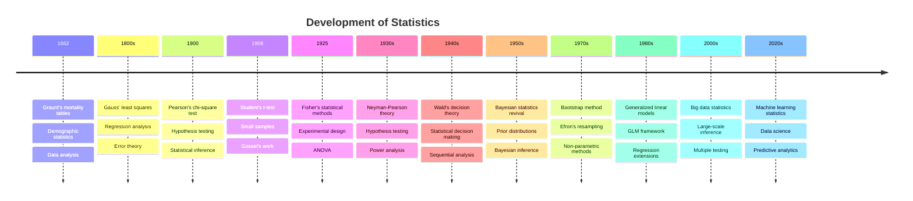

```mermaid
timeline
    title Development of Statistics
    1662 : Graunt's mortality tables
          : Demographic statistics
          : Data analysis
    1800s : Gauss' least squares
          : Regression analysis
          : Error theory
    1900 : Pearson's chi-square test
          : Hypothesis testing
          : Statistical inference
    1908 : Student's t-test
          : Small samples
          : Gosset's work
    1925 : Fisher's statistical methods
          : Experimental design
          : ANOVA
    1930s : Neyman-Pearson theory
          : Hypothesis testing
          : Power analysis
    1940s : Wald's decision theory
          : Statistical decision making
          : Sequential analysis
    1950s : Bayesian statistics revival
          : Prior distributions
          : Bayesian inference
    1970s : Bootstrap method
          : Efron's resampling
          : Non-parametric methods
    1980s : Generalized linear models
          : GLM framework
          : Regression extensions
    2000s : Big data statistics
          : Large-scale inference
          : Multiple testing
    2020s : Machine learning statistics
          : Data science
          : Predictive analytics
```
