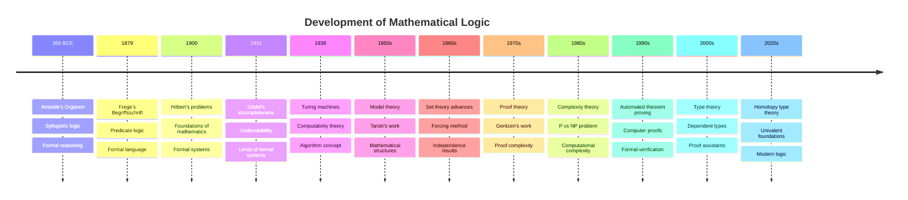

```mermaid
timeline
    title Development of Mathematical Logic
    350 BCE : Aristotle's Organon
          : Syllogistic logic
          : Formal reasoning
    1879 : Frege's Begriffsschrift
          : Predicate logic
          : Formal language
    1900 : Hilbert's problems
          : Foundations of mathematics
          : Formal systems
    1931 : Gödel's incompleteness
          : Undecidability
          : Limits of formal systems
    1936 : Turing machines
          : Computability theory
          : Algorithm concept
    1950s : Model theory
          : Tarski's work
          : Mathematical structures
    1960s : Set theory advances
          : Forcing method
          : Independence results
    1970s : Proof theory
          : Gentzen's work
          : Proof complexity
    1980s : Complexity theory
          : P vs NP problem
          : Computational complexity
    1990s : Automated theorem proving
          : Computer proofs
          : Formal verification
    2000s : Type theory
          : Dependent types
          : Proof assistants
    2020s : Homotopy type theory
          : Univalent foundations
          : Modern logic
```
