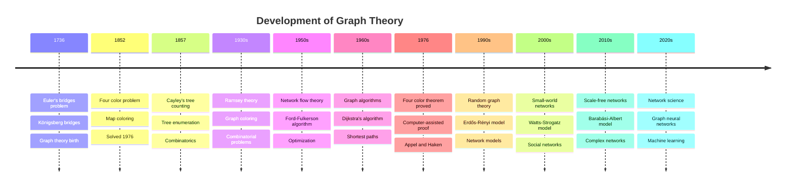

```mermaid
timeline
    title Development of Graph Theory
    1736 : Euler's bridges problem
          : Königsberg bridges
          : Graph theory birth
    1852 : Four color problem
          : Map coloring
          : Solved 1976
    1857 : Cayley's tree counting
          : Tree enumeration
          : Combinatorics
    1930s : Ramsey theory
          : Graph coloring
          : Combinatorial problems
    1950s : Network flow theory
          : Ford-Fulkerson algorithm
          : Optimization
    1960s : Graph algorithms
          : Dijkstra's algorithm
          : Shortest paths
    1976 : Four color theorem proved
          : Computer-assisted proof
          : Appel and Haken
    1990s : Random graph theory
          : Erdős-Rényi model
          : Network models
    2000s : Small-world networks
          : Watts-Strogatz model
          : Social networks
    2010s : Scale-free networks
          : Barabási-Albert model
          : Complex networks
    2020s : Network science
          : Graph neural networks
          : Machine learning
```
