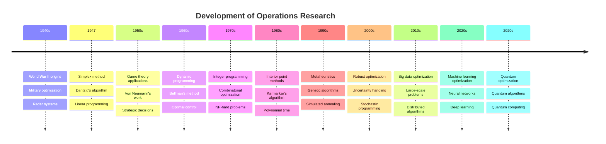

```mermaid
timeline
    title Development of Operations Research
    1940s : World War II origins
          : Military optimization
          : Radar systems
    1947 : Simplex method
          : Dantzig's algorithm
          : Linear programming
    1950s : Game theory applications
          : Von Neumann's work
          : Strategic decisions
    1960s : Dynamic programming
          : Bellman's method
          : Optimal control
    1970s : Integer programming
          : Combinatorial optimization
          : NP-hard problems
    1980s : Interior point methods
          : Karmarkar's algorithm
          : Polynomial time
    1990s : Metaheuristics
          : Genetic algorithms
          : Simulated annealing
    2000s : Robust optimization
          : Uncertainty handling
          : Stochastic programming
    2010s : Big data optimization
          : Large-scale problems
          : Distributed algorithms
    2020s : Machine learning optimization
          : Neural networks
          : Deep learning
    2020s : Quantum optimization
          : Quantum algorithms
          : Quantum computing
```
