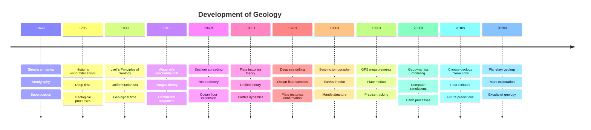

```mermaid
timeline
    title Development of Geology
    1669 : Steno's principles
          : Stratigraphy
          : Superposition
    1785 : Hutton's uniformitarianism
          : Deep time
          : Geological processes
    1830 : Lyell's Principles of Geology
          : Uniformitarianism
          : Geological time
    1912 : Wegener's continental drift
          : Pangea theory
          : Continental movement
    1960s : Seafloor spreading
          : Hess's theory
          : Ocean floor expansion
    1960s : Plate tectonics theory
          : Unified theory
          : Earth's dynamics
    1970s : Deep sea drilling
          : Ocean floor samples
          : Plate tectonics confirmation
    1980s : Seismic tomography
          : Earth's interior
          : Mantle structure
    1990s : GPS measurements
          : Plate motion
          : Precise tracking
    2000s : Geodynamics modeling
          : Computer simulations
          : Earth processes
    2010s : Climate-geology interactions
          : Past climates
          : Future predictions
    2020s : Planetary geology
          : Mars exploration
          : Exoplanet geology
```
