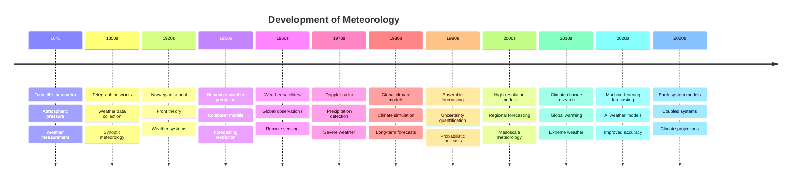

```mermaid
timeline
    title Development of Meteorology
    1643 : Torricelli's barometer
          : Atmospheric pressure
          : Weather measurement
    1850s : Telegraph networks
          : Weather data collection
          : Synoptic meteorology
    1920s : Norwegian school
          : Front theory
          : Weather systems
    1950s : Numerical weather prediction
          : Computer models
          : Forecasting revolution
    1960s : Weather satellites
          : Global observations
          : Remote sensing
    1970s : Doppler radar
          : Precipitation detection
          : Severe weather
    1980s : Global climate models
          : Climate simulation
          : Long-term forecasts
    1990s : Ensemble forecasting
          : Uncertainty quantification
          : Probabilistic forecasts
    2000s : High-resolution models
          : Regional forecasting
          : Mesoscale meteorology
    2010s : Climate change research
          : Global warming
          : Extreme weather
    2020s : Machine learning forecasting
          : AI weather models
          : Improved accuracy
    2020s : Earth system models
          : Coupled systems
          : Climate projections
```
