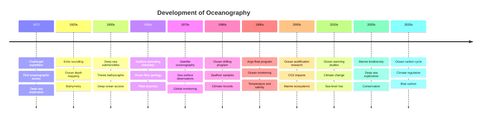

```mermaid
timeline
    title Development of Oceanography
    1872 : Challenger expedition
          : First oceanographic survey
          : Deep sea exploration
    1920s : Echo sounding
          : Ocean depth mapping
          : Bathymetry
    1950s : Deep sea submersibles
          : Trieste bathyscaphe
          : Deep ocean access
    1960s : Seafloor spreading discovery
          : Ocean floor geology
          : Plate tectonics
    1970s : Satellite oceanography
          : Sea surface observations
          : Global monitoring
    1980s : Ocean drilling program
          : Seafloor samples
          : Climate records
    1990s : Argo float program
          : Ocean monitoring
          : Temperature and salinity
    2000s : Ocean acidification research
          : CO2 impacts
          : Marine ecosystems
    2010s : Ocean warming studies
          : Climate change
          : Sea level rise
    2020s : Marine biodiversity
          : Deep sea exploration
          : Conservation
    2020s : Ocean carbon cycle
          : Climate regulation
          : Blue carbon
```
