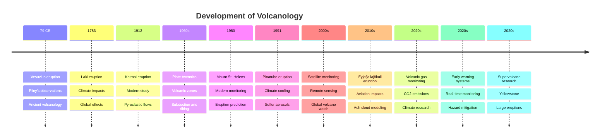

```mermaid
timeline
    title Development of Volcanology
    79 CE : Vesuvius eruption
          : Pliny's observations
          : Ancient volcanology
    1783 : Laki eruption
          : Climate impacts
          : Global effects
    1912 : Katmai eruption
          : Modern study
          : Pyroclastic flows
    1960s : Plate tectonics
          : Volcanic zones
          : Subduction and rifting
    1980 : Mount St. Helens
          : Modern monitoring
          : Eruption prediction
    1991 : Pinatubo eruption
          : Climate cooling
          : Sulfur aerosols
    2000s : Satellite monitoring
          : Remote sensing
          : Global volcano watch
    2010s : Eyjafjallajökull eruption
          : Aviation impacts
          : Ash cloud modeling
    2020s : Volcanic gas monitoring
          : CO2 emissions
          : Climate research
    2020s : Early warning systems
          : Real-time monitoring
          : Hazard mitigation
    2020s : Supervolcano research
          : Yellowstone
          : Large eruptions
```
