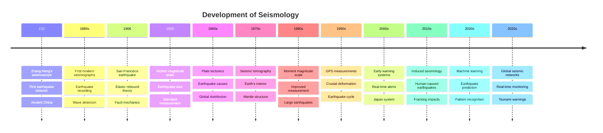

```mermaid
timeline
    title Development of Seismology
    132 : Zhang Heng's seismoscope
          : First earthquake detector
          : Ancient China
    1880s : First modern seismographs
          : Earthquake recording
          : Wave detection
    1906 : San Francisco earthquake
          : Elastic rebound theory
          : Fault mechanics
    1935 : Richter magnitude scale
          : Earthquake size
          : Standard measurement
    1960s : Plate tectonics
          : Earthquake causes
          : Global distribution
    1970s : Seismic tomography
          : Earth's interior
          : Mantle structure
    1980s : Moment magnitude scale
          : Improved measurement
          : Large earthquakes
    1990s : GPS measurements
          : Crustal deformation
          : Earthquake cycle
    2000s : Early warning systems
          : Real-time alerts
          : Japan system
    2010s : Induced seismology
          : Human-caused earthquakes
          : Fracking impacts
    2020s : Machine learning
          : Earthquake prediction
          : Pattern recognition
    2020s : Global seismic networks
          : Real-time monitoring
          : Tsunami warnings
```
