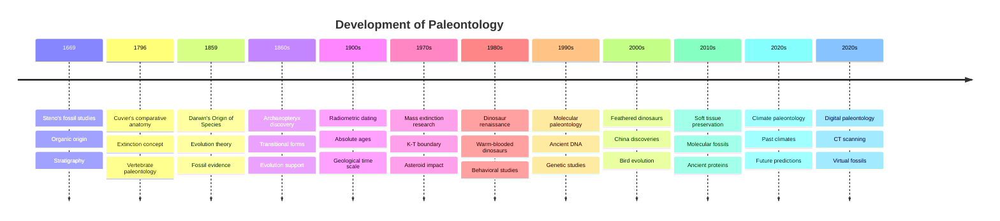

```mermaid
timeline
    title Development of Paleontology
    1669 : Steno's fossil studies
          : Organic origin
          : Stratigraphy
    1796 : Cuvier's comparative anatomy
          : Extinction concept
          : Vertebrate paleontology
    1859 : Darwin's Origin of Species
          : Evolution theory
          : Fossil evidence
    1860s : Archaeopteryx discovery
          : Transitional forms
          : Evolution support
    1900s : Radiometric dating
          : Absolute ages
          : Geological time scale
    1970s : Mass extinction research
          : K-T boundary
          : Asteroid impact
    1980s : Dinosaur renaissance
          : Warm-blooded dinosaurs
          : Behavioral studies
    1990s : Molecular paleontology
          : Ancient DNA
          : Genetic studies
    2000s : Feathered dinosaurs
          : China discoveries
          : Bird evolution
    2010s : Soft tissue preservation
          : Molecular fossils
          : Ancient proteins
    2020s : Climate paleontology
          : Past climates
          : Future predictions
    2020s : Digital paleontology
          : CT scanning
          : Virtual fossils
```
