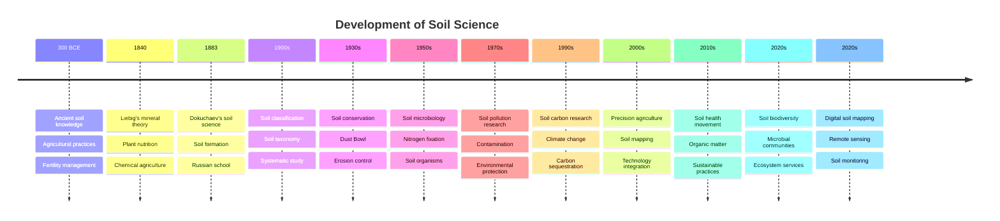

```mermaid
timeline
    title Development of Soil Science
    300 BCE : Ancient soil knowledge
          : Agricultural practices
          : Fertility management
    1840 : Liebig's mineral theory
          : Plant nutrition
          : Chemical agriculture
    1883 : Dokuchaev's soil science
          : Soil formation
          : Russian school
    1900s : Soil classification
          : Soil taxonomy
          : Systematic study
    1930s : Soil conservation
          : Dust Bowl
          : Erosion control
    1950s : Soil microbiology
          : Nitrogen fixation
          : Soil organisms
    1970s : Soil pollution research
          : Contamination
          : Environmental protection
    1990s : Soil carbon research
          : Climate change
          : Carbon sequestration
    2000s : Precision agriculture
          : Soil mapping
          : Technology integration
    2010s : Soil health movement
          : Organic matter
          : Sustainable practices
    2020s : Soil biodiversity
          : Microbial communities
          : Ecosystem services
    2020s : Digital soil mapping
          : Remote sensing
          : Soil monitoring
```
