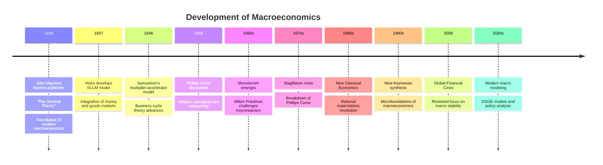

```mermaid
timeline
    title Development of Macroeconomics
    1936 : John Maynard Keynes publishes
          : "The General Theory"
          : Foundation of modern macroeconomics
    1937 : Hicks develops IS-LM model
          : Integration of money and goods markets
    1946 : Samuelson's multiplier-accelerator model
          : Business cycle theory advances
    1958 : Phillips Curve discovered
          : Inflation-unemployment relationship
    1960s : Monetarism emerges
          : Milton Friedman challenges Keynesianism
    1970s : Stagflation crisis
          : Breakdown of Phillips Curve
    1980s : New Classical Economics
          : Rational expectations revolution
    1990s : New Keynesian synthesis
          : Microfoundations of macroeconomics
    2008 : Global Financial Crisis
          : Renewed focus on macro stability
    2020s : Modern macro modeling
          : DSGE models and policy analysis
```
