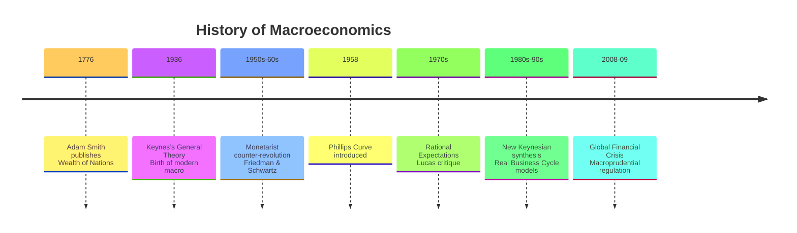

```mermaid
%%{init: {"theme": "base", "timeline": {"lineColor": "#4A6FA5", "titleColor": "#333"}}}%%
timeline
    title History of Macroeconomics
    1776 : Adam Smith publishes<br>Wealth of Nations
    1936 : Keynes’s General Theory<br>Birth of modern macro
    1950s-60s : Monetarist counter‑revolution<br>Friedman & Schwartz
    1958 : Phillips Curve introduced
    1970s : Rational Expectations<br>Lucas critique
    1980s-90s : New Keynesian synthesis<br>Real Business Cycle models
    2008-09 : Global Financial Crisis<br>Macroprudential regulation
```
