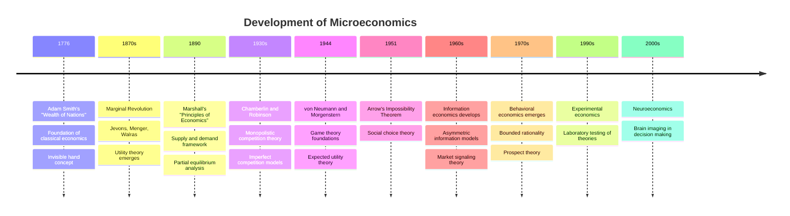

```mermaid
timeline
    title Development of Microeconomics
    1776 : Adam Smith's "Wealth of Nations"
          : Foundation of classical economics
          : Invisible hand concept
    1870s : Marginal Revolution
          : Jevons, Menger, Walras
          : Utility theory emerges
    1890 : Marshall's "Principles of Economics"
          : Supply and demand framework
          : Partial equilibrium analysis
    1930s : Chamberlin and Robinson
          : Monopolistic competition theory
          : Imperfect competition models
    1944 : von Neumann and Morgenstern
          : Game theory foundations
          : Expected utility theory
    1951 : Arrow's Impossibility Theorem
          : Social choice theory
    1960s : Information economics develops
          : Asymmetric information models
          : Market signaling theory
    1970s : Behavioral economics emerges
          : Bounded rationality
          : Prospect theory
    1990s : Experimental economics
          : Laboratory testing of theories
    2000s : Neuroeconomics
          : Brain imaging in decision making
```
