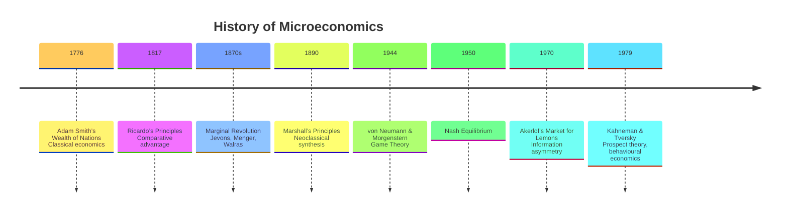

```mermaid
%%{init: {"theme": "base", "timeline": {"lineColor": "#4A6FA5", "titleColor": "#333"}}}%%
timeline
    title History of Microeconomics
    1776 : Adam Smith’s Wealth of Nations<br>Classical economics
    1817 : Ricardo’s Principles<br>Comparative advantage
    1870s : Marginal Revolution<br>Jevons, Menger, Walras
    1890 : Marshall’s Principles<br>Neoclassical synthesis
    1944 : von Neumann & Morgenstern<br>Game Theory
    1950 : Nash Equilibrium
    1970 : Akerlof’s Market for Lemons<br>Information asymmetry
    1979 : Kahneman & Tversky<br>Prospect theory, behavioural economics
```
