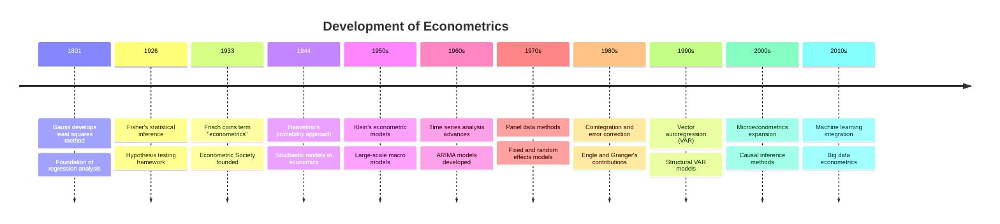

```mermaid
timeline
    title Development of Econometrics
    1801 : Gauss develops least squares method
          : Foundation of regression analysis
    1926 : Fisher's statistical inference
          : Hypothesis testing framework
    1933 : Frisch coins term "econometrics"
          : Econometric Society founded
    1944 : Haavelmo's probability approach
          : Stochastic models in economics
    1950s : Klein's econometric models
          : Large-scale macro models
    1960s : Time series analysis advances
          : ARIMA models developed
    1970s : Panel data methods
          : Fixed and random effects models
    1980s : Cointegration and error correction
          : Engle and Granger's contributions
    1990s : Vector autoregression (VAR)
          : Structural VAR models
    2000s : Microeconometrics expansion
          : Causal inference methods
    2010s : Machine learning integration
          : Big data econometrics
```
