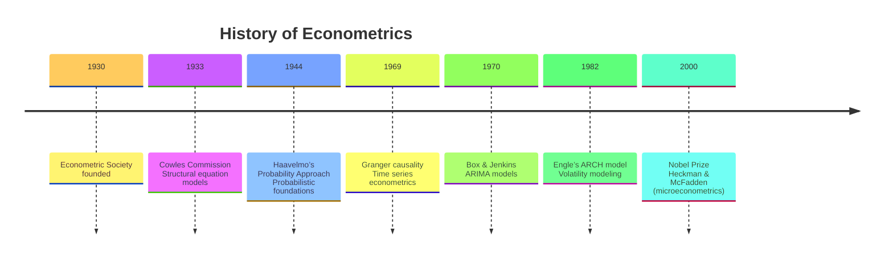

```mermaid
%%{init: {"theme": "base", "timeline": {"lineColor": "#4A6FA5", "titleColor": "#333"}}}%%
timeline
    title History of Econometrics
    1930 : Econometric Society founded
    1933 : Cowles Commission<br>Structural equation models
    1944 : Haavelmo’s Probability Approach<br>Probabilistic foundations
    1969 : Granger causality<br>Time series econometrics
    1970 : Box & Jenkins<br>ARIMA models
    1982 : Engle’s ARCH model<br>Volatility modeling
    2000 : Nobel Prize<br>Heckman & McFadden (microeconometrics)
```
