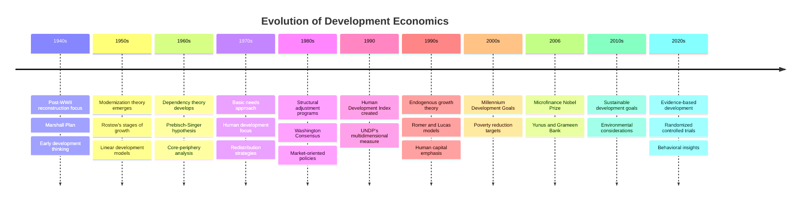

```mermaid
timeline
    title Evolution of Development Economics
    1940s : Post-WWII reconstruction focus
          : Marshall Plan
          : Early development thinking
    1950s : Modernization theory emerges
          : Rostow's stages of growth
          : Linear development models
    1960s : Dependency theory develops
          : Prebisch-Singer hypothesis
          : Core-periphery analysis
    1970s : Basic needs approach
          : Human development focus
          : Redistribution strategies
    1980s : Structural adjustment programs
          : Washington Consensus
          : Market-oriented policies
    1990 : Human Development Index created
          : UNDP's multidimensional measure
    1990s : Endogenous growth theory
          : Romer and Lucas models
          : Human capital emphasis
    2000s : Millennium Development Goals
          : Poverty reduction targets
    2006 : Microfinance Nobel Prize
          : Yunus and Grameen Bank
    2010s : Sustainable development goals
          : Environmental considerations
    2020s : Evidence-based development
          : Randomized controlled trials
          : Behavioral insights
```
