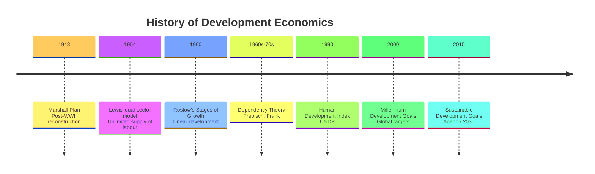

```mermaid
%%{init: {"theme": "base", "timeline": {"lineColor": "#4A6FA5", "titleColor": "#333"}}}%%
timeline
    title History of Development Economics
    1948 : Marshall Plan<br>Post‑WWII reconstruction
    1954 : Lewis’ dual‑sector model<br>Unlimited supply of labour
    1960 : Rostow’s Stages of Growth<br>Linear development
    1960s‑70s : Dependency Theory<br>Prebisch, Frank
    1990 : Human Development Index<br>UNDP
    2000 : Millennium Development Goals<br>Global targets
    2015 : Sustainable Development Goals<br>Agenda 2030
```
