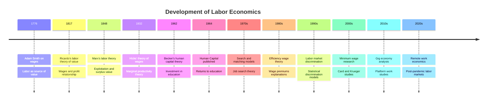

```mermaid
timeline
    title Development of Labor Economics
    1776 : Adam Smith on wages
          : Labor as source of value
    1817 : Ricardo's labor theory of value
          : Wages and profit relationship
    1848 : Marx's labor theory
          : Exploitation and surplus value
    1932 : Hicks' theory of wages
          : Marginal productivity theory
    1962 : Becker's human capital theory
          : Investment in education
    1964 : Human Capital published
          : Returns to education
    1970s : Search and matching models
          : Job search theory
    1980s : Efficiency wage theory
          : Wage premiums explanations
    1990s : Labor market discrimination
          : Statistical discrimination models
    2000s : Minimum wage research
          : Card and Krueger studies
    2010s : Gig economy analysis
          : Platform work studies
    2020s : Remote work economics
          : Post-pandemic labor markets
```
