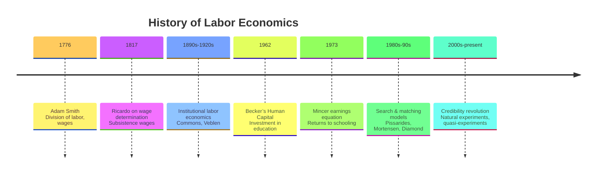

```mermaid
%%{init: {"theme": "base", "timeline": {"lineColor": "#4A6FA5", "titleColor": "#333"}}}%%
timeline
    title History of Labor Economics
    1776 : Adam Smith<br>Division of labor, wages
    1817 : Ricardo on wage determination<br>Subsistence wages
    1890s‑1920s : Institutional labor economics<br>Commons, Veblen
    1962 : Becker’s Human Capital<br>Investment in education
    1973 : Mincer earnings equation<br>Returns to schooling
    1980s‑90s : Search & matching models<br>Pissarides, Mortensen, Diamond
    2000s‑present : Credibility revolution<br>Natural experiments, quasi‑experiments
```
