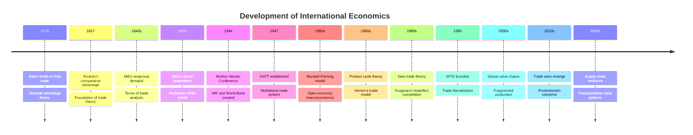

```mermaid
timeline
    title Development of International Economics
    1776 : Adam Smith on free trade
          : Absolute advantage theory
    1817 : Ricardo's comparative advantage
          : Foundation of trade theory
    1840s : Mill's reciprocal demand
          : Terms of trade analysis
    1933 : Ohlin's factor proportions
          : Heckscher-Ohlin model
    1944 : Bretton Woods Conference
          : IMF and World Bank created
    1947 : GATT established
          : Multilateral trade system
    1950s : Mundell-Fleming model
          : Open economy macroeconomics
    1960s : Product cycle theory
          : Vernon's trade model
    1980s : New trade theory
          : Krugman's imperfect competition
    1995 : WTO founded
          : Trade liberalization
    2000s : Global value chains
          : Fragmented production
    2010s : Trade wars emerge
          : Protectionism concerns
    2020s : Supply chain resilience
          : Post-pandemic trade patterns
```
