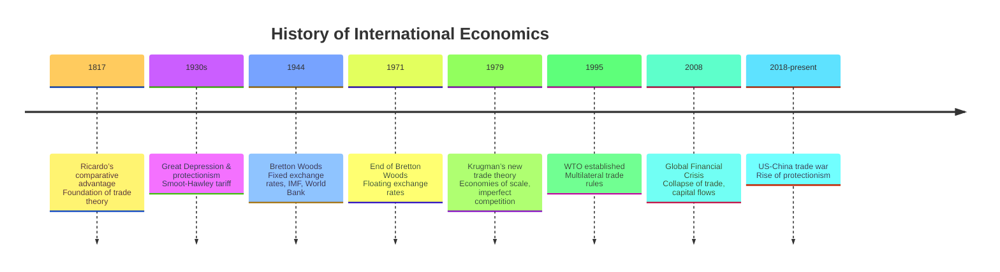

```mermaid
%%{init: {"theme": "base", "timeline": {"lineColor": "#4A6FA5", "titleColor": "#333"}}}%%
timeline
    title History of International Economics
    1817 : Ricardo’s comparative advantage<br>Foundation of trade theory
    1930s : Great Depression & protectionism<br>Smoot‑Hawley tariff
    1944 : Bretton Woods<br>Fixed exchange rates, IMF, World Bank
    1971 : End of Bretton Woods<br>Floating exchange rates
    1979 : Krugman’s new trade theory<br>Economies of scale, imperfect competition
    1995 : WTO established<br>Multilateral trade rules
    2008 : Global Financial Crisis<br>Collapse of trade, capital flows
    2018‑present : US‑China trade war<br>Rise of protectionism
```
