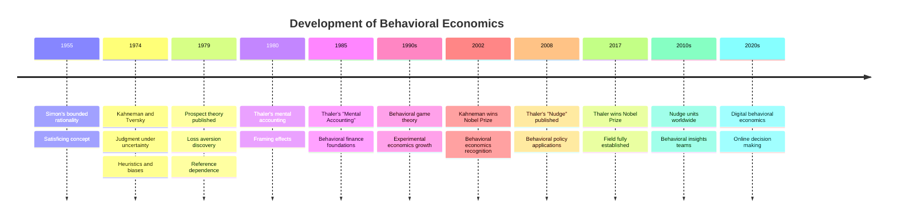

```mermaid
timeline
    title Development of Behavioral Economics
    1955 : Simon's bounded rationality
          : Satisficing concept
    1974 : Kahneman and Tversky
          : Judgment under uncertainty
          : Heuristics and biases
    1979 : Prospect theory published
          : Loss aversion discovery
          : Reference dependence
    1980 : Thaler's mental accounting
          : Framing effects
    1985 : Thaler's "Mental Accounting"
          : Behavioral finance foundations
    1990s : Behavioral game theory
          : Experimental economics growth
    2002 : Kahneman wins Nobel Prize
          : Behavioral economics recognition
    2008 : Thaler's "Nudge" published
          : Behavioral policy applications
    2017 : Thaler wins Nobel Prize
          : Field fully established
    2010s : Nudge units worldwide
          : Behavioral insights teams
    2020s : Digital behavioral economics
          : Online decision making
```
