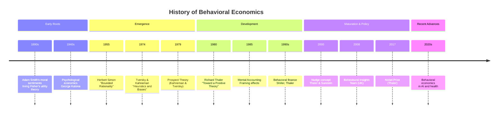

```mermaid
timeline
    title History of Behavioral Economics
    section Early Roots
      1890s : Adam Smith's moral sentiments<br>Irving Fisher's utility theory
      1940s : Psychological economics<br>George Katona
    section Emergence
      1955 : Herbert Simon<br>"Bounded Rationality"
      1974 : Tversky & Kahneman<br>"Heuristics and Biases"
      1979 : Prospect Theory<br>(Kahneman & Tversky)
    section Development
      1980 : Richard Thaler<br>"Toward a Positive Theory"
      1985 : Mental Accounting<br>Framing effects
      1990s : Behavioral finance<br>Shiller, Thaler
    section Maturation & Policy
      2000 : Nudge concept<br>Thaler & Sunstein
      2008 : Behavioural Insights<br>Team (UK)
      2017 : Nobel Prize<br>(Thaler)
    section Recent Advances
      2020s : Behavioral economics<br>in AI and health
```
