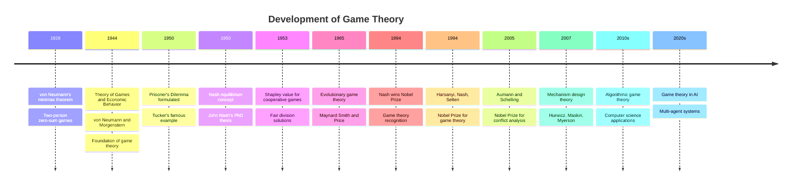

```mermaid
timeline
    title Development of Game Theory
    1928 : von Neumann's minimax theorem
          : Two-person zero-sum games
    1944 : Theory of Games and Economic Behavior
          : von Neumann and Morgenstern
          : Foundation of game theory
    1950 : Prisoner's Dilemma formulated
          : Tucker's famous example
    1950 : Nash equilibrium concept
          : John Nash's PhD thesis
    1953 : Shapley value for cooperative games
          : Fair division solutions
    1965 : Evolutionary game theory
          : Maynard Smith and Price
    1994 : Nash wins Nobel Prize
          : Game theory recognition
    1994 : Harsanyi, Nash, Selten
          : Nobel Prize for game theory
    2005 : Aumann and Schelling
          : Nobel Prize for conflict analysis
    2007 : Mechanism design theory
          : Hurwicz, Maskin, Myerson
    2010s : Algorithmic game theory
          : Computer science applications
    2020s : Game theory in AI
          : Multi-agent systems
```
