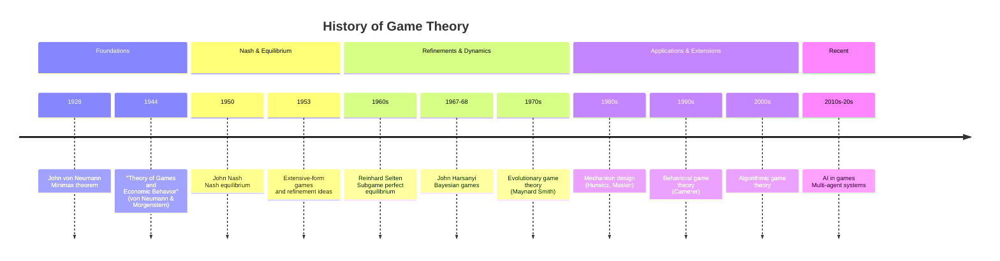

```mermaid
timeline
    title History of Game Theory
    section Foundations
      1928 : John von Neumann<br>Minimax theorem
      1944 : "Theory of Games and<br>Economic Behavior"<br>(von Neumann & Morgenstern)
    section Nash & Equilibrium
      1950 : John Nash<br>Nash equilibrium
      1953 : Extensive-form games<br>and refinement ideas
    section Refinements & Dynamics
      1960s : Reinhard Selten<br>Subgame perfect equilibrium
      1967-68 : John Harsanyi<br>Bayesian games
      1970s : Evolutionary game theory<br>(Maynard Smith)
    section Applications & Extensions
      1980s : Mechanism design<br>(Hurwicz, Maskin)
      1990s : Behavioral game theory<br>(Camerer)
      2000s : Algorithmic game theory
    section Recent
      2010s-20s : AI in games<br>Multi-agent systems
```
