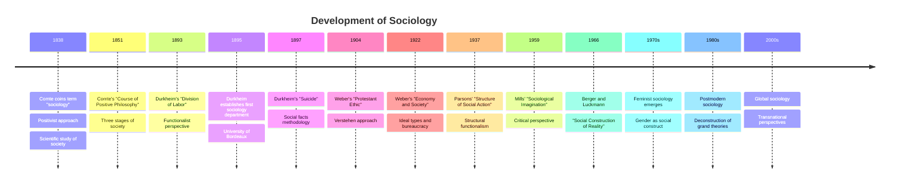

```mermaid
timeline
    title Development of Sociology
    1838 : Comte coins term "sociology"
          : Positivist approach
          : Scientific study of society
    1851 : Comte's "Course of Positive Philosophy"
          : Three stages of society
    1893 : Durkheim's "Division of Labor"
          : Functionalist perspective
    1895 : Durkheim establishes first sociology department
          : University of Bordeaux
    1897 : Durkheim's "Suicide"
          : Social facts methodology
    1904 : Weber's "Protestant Ethic"
          : Verstehen approach
    1922 : Weber's "Economy and Society"
          : Ideal types and bureaucracy
    1937 : Parsons' "Structure of Social Action"
          : Structural functionalism
    1959 : Mills' "Sociological Imagination"
          : Critical perspective
    1966 : Berger and Luckmann
          : "Social Construction of Reality"
    1970s : Feminist sociology emerges
          : Gender as social construct
    1980s : Postmodern sociology
          : Deconstruction of grand theories
    2000s : Global sociology
          : Transnational perspectives
```
